# OZ Account Policy Builder — Technical Architecture

> AI-assisted toolkit for crafting OpenZeppelin smart account policies from observed Stellar transactions.
> Record → Synthesize → Emit → Harness → Install

---

## Table of Contents

1. [System Overview](#system-overview)
2. [High-Level Architecture](#high-level-architecture)
3. [Monorepo Structure](#monorepo-structure)
4. [Pipeline Architecture](#pipeline-architecture)
5. [MCP Server Architecture](#mcp-server-architecture)
6. [Contract Layer Architecture](#contract-layer-architecture)
7. [Wallet Integration](#wallet-integration)
8. [Data Flow & Sequence Diagrams](#data-flow--sequence-diagrams)
9. [Security Architecture](#security-architecture)
10. [Deployment Architecture](#deployment-architecture)
11. [Technology Stack](#technology-stack)
12. [Extension Points](#extension-points)

---

## System Overview

The OZ Policy Builder is a developer/end-user toolkit that synthesizes OpenZeppelin smart account policies from observed or simulated Stellar transactions. It implements a "record-and-generate" workflow where:

1. A user executes a representative transaction (e.g., claiming yield on Blend)
2. The tool analyzes contract calls, auth entries, and asset flows
3. A policy synthesizer produces a context rule + minimum policy set
4. The output is reviewable Rust code — deployment is always explicit and manual

The system is **not** a hosted service that auto-deploys policies. It generates code; the user deploys.

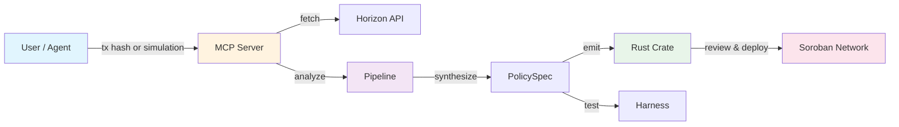

---

## High-Level Architecture

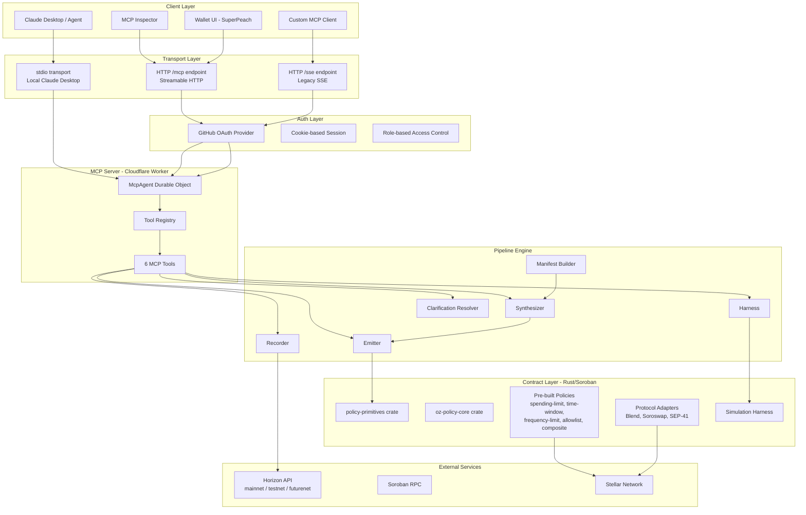

---

## Monorepo Structure

```
oz-account-policy-builder/
├── apps/
│   ├── mcp-server/          # Cloudflare Worker MCP server (TypeScript)
│   │   ├── src/
│   │   │   ├── index.ts           # HTTP Worker entry (Durable Object)
│   │   │   ├── stdio.ts           # Local stdio transport for Claude Desktop
│   │   │   ├── types.ts           # Zod schemas, response helpers
│   │   │   ├── auth/              # GitHub OAuth flow
│   │   │   ├── pipeline/          # Core logic (TS port of Rust core)
│   │   │   │   ├── recorder.ts    # Fetch tx from Horizon
│   │   │   │   ├── manifest.ts    # Build CallManifest
│   │   │   │   ├── synthesizer.ts # Decision tree → PolicySpec
│   │   │   │   ├── emitter.ts     # PolicySpec → Rust crate
│   │   │   │   ├── harness.ts     # Permit/deny simulation
│   │   │   │   ├── primitives.ts  # OZ primitive registry
│   │   │   │   └── clarification.ts # Resolve ambiguities
│   │   │   └── tools/             # MCP tool handlers
│   │   │       ├── register-tools.ts
│   │   │       └── policy-tools.ts   # 6 policy pipeline tools
│   │   ├── tests/
│   │   └── contracts/             # Embedded policy-primitives source
│   │
│   ├── wallet/              # SuperPeach — passkey smart wallet (Astro/Svelte)
│   └── docs/                # Next.js documentation site
│
├── contracts/               # Rust Soroban contracts (Cargo workspace)
│   ├── core/                # Transaction analyzer + synthesizer (Rust)
│   ├── policy-primitives/   # Base traits, storage helpers
│   ├── policies/            # Pre-built policy contracts
│   │   ├── spending-limit/
│   │   ├── time-window/
│   │   ├── frequency-limit/
│   │   ├── allowlist/
│   │   └── composite/
│   ├── protocol-adapters/   # DeFi protocol integrations
│   │   ├── blend/
│   │   ├── soroswap/
│   │   └── sep41/
│   └── simulation-harness/  # On-chain permit/deny test runner
│
├── packages/                # Shared TS packages (eslint, tsconfig, UI)
├── Cargo.toml               # Rust workspace root
├── turbo.json               # Turborepo task runner
└── pnpm-workspace.yaml      # PNPM workspace definition
```

---

## Pipeline Architecture

The pipeline implements a 6-stage decision flow. Each stage is stateless and deterministic.

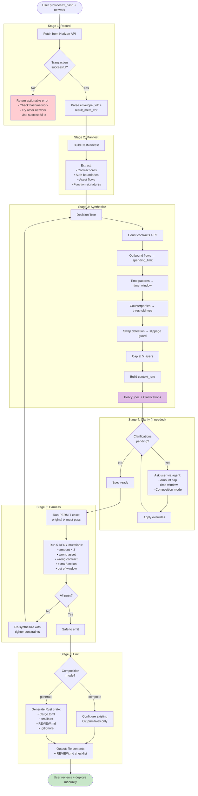

### Pipeline Data Types

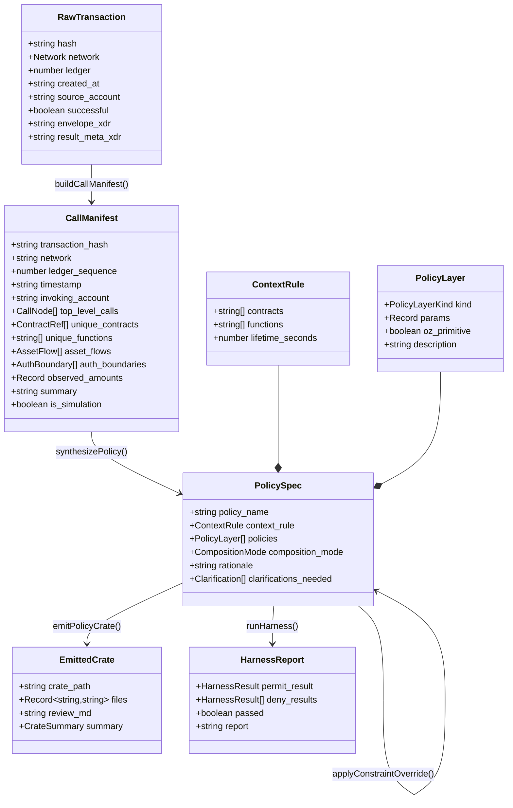

---

## MCP Server Architecture

### Dual Transport Design

The MCP server supports two deployment modes:

| Mode | Transport | Use Case | Auth |
|------|-----------|----------|------|
| **Local (stdio)** | stdin/stdout | Claude Desktop, local dev | None needed |
| **Remote (HTTP)** | Cloudflare Worker + Durable Object | Multi-user, deployed | GitHub OAuth |

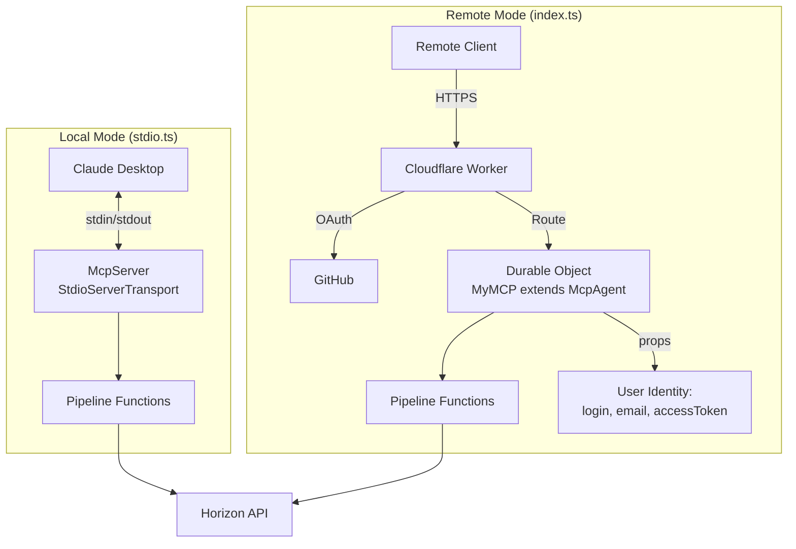

### Tool Inventory

| # | Tool | Input | Output | Stateless |
|---|------|-------|--------|-----------|
| 1 | `record_transaction` | tx_hash, network, invoking_account? | CallManifest | ✅ |
| 2 | `synthesize_policy` | manifest_json, constraints? | PolicySpec + Clarifications | ✅ |
| 3 | `emit_policy_crate` | spec_json, output_dir? | EmittedCrate (files as strings) | ✅ |
| 4 | `run_harness` | spec_json, manifest_json | HarnessReport (permit + 5 deny) | ✅ |
| 5 | `list_primitives` | (none) | OZ primitive catalog | ✅ |
| 6 | `answer_clarification` | spec_json, field, answer | Updated PolicySpec | ✅ |

All tools are deterministic and side-effect-free. No tool deploys anything.

### Error Handling Strategy

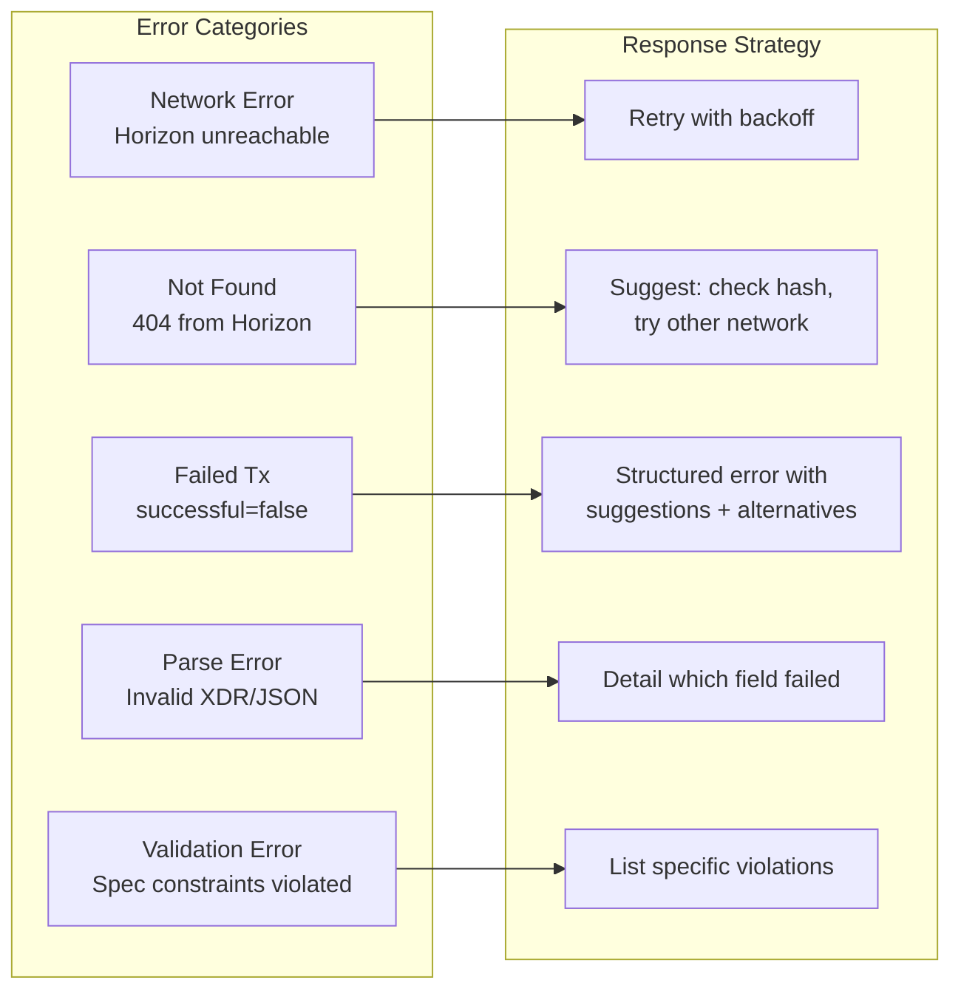

---

## Contract Layer Architecture

### Rust Workspace

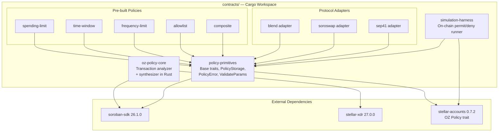

### Policy Trait (from stellar-accounts)

```rust
pub trait Policy {
    type AccountParams;

    fn install(e: &Env, params: Self::AccountParams, rule: ContextRule, account: Address);
    fn enforce(e: &Env, ctx: Context, signers: Vec<Signer>, rule: ContextRule, account: Address);
    fn uninstall(e: &Env, rule: ContextRule, account: Address);
}
```

### Storage Segregation Pattern

Every policy MUST scope its storage by `(smart_account, context_rule.id)` to prevent cross-account data leakage:

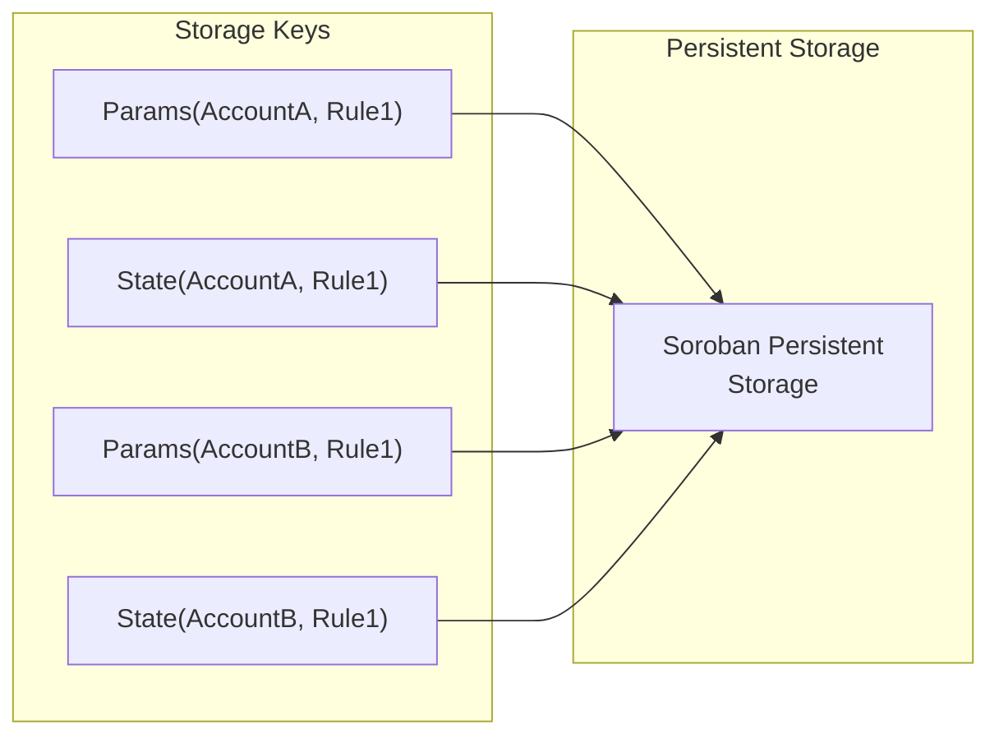

### Composition Modes

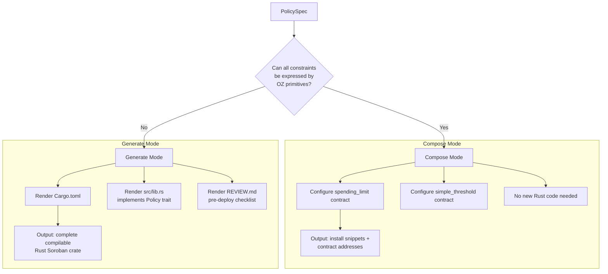

---

## Wallet Integration

### SuperPeach (Passkey Smart Wallet)

The wallet serves as the reference integration for the end-to-end flow: record → generate → simulate → sign → install.

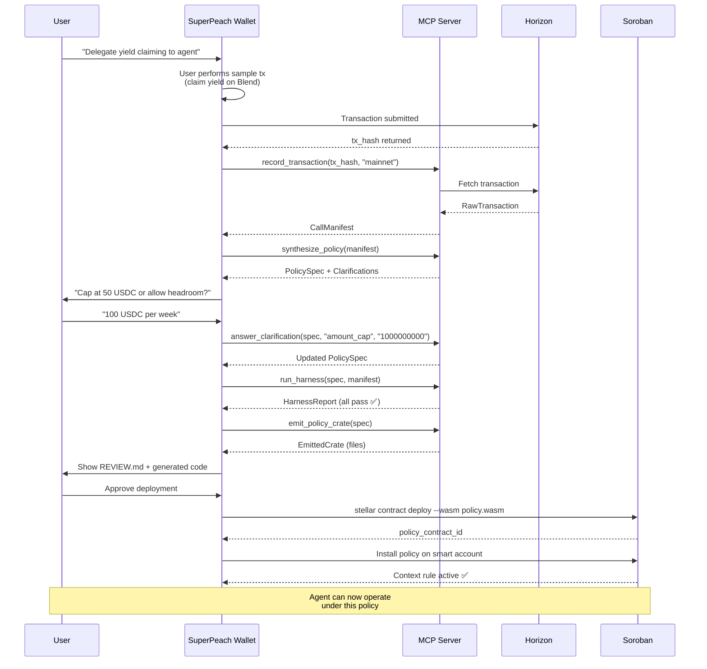

### Wallet Tech Stack

| Component | Technology | Role |
|-----------|-----------|------|
| Framework | Astro + Svelte | SSR + reactive UI |
| Auth | Passkeys (WebAuthn) | Passwordless signing |
| Stellar SDK | `@stellar/stellar-sdk` | Transaction building |
| Smart Account | `passkey-kit` | OZ smart account management |
| Styling | Tailwind CSS | UI components |
| Deployment | Cloudflare Pages | Static hosting |

---

## Data Flow & Sequence Diagrams

### Complete Record-to-Install Flow

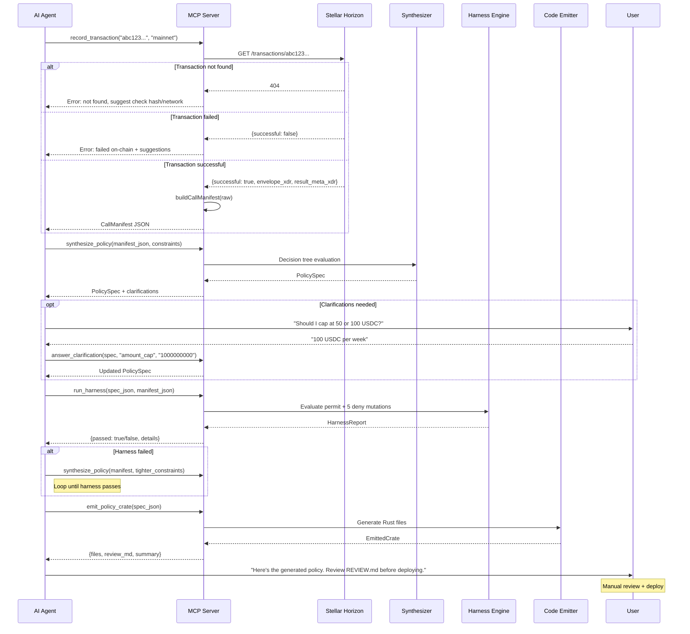

### Synthesizer Decision Tree

```mermaid
flowchart TD
    M[CallManifest] --> S1{unique_contracts > 3?}
    
    S1 -->|Yes| CL1[Clarification: compose vs generate?]
    S1 -->|No| S2

    S2{Outbound asset flows?}
    S2 -->|Yes| SPL[Add: spending_limit layer<br/>cap = observed amount<br/>window = inferred]
    S2 -->|Yes + no cap specified| CL2[Clarification: exact cap or headroom?]
    S2 -->|No| S3

    SPL --> S3{Auth boundaries present?}
    S3 -->|Yes + no window specified| CL3[Clarification: daily/weekly/monthly?]
    S3 --> TW[Add: time_window layer]

    TW --> S4{Single contract + function?}
    S4 -->|Yes| ST[Add: simple_threshold<br/>threshold=1]
    S4 -->|No| WT[Add: weighted_threshold]

    ST --> S5
    WT --> S5{Function contains "swap"?}
    S5 -->|Yes| SG[Add: custom slippage_guard<br/>mark as generate mode]
    S5 -->|No| S6

    SG --> S6{Total layers > 5?}
    S6 -->|Yes| TRIM[Merge time_window into<br/>spending_limit.window_seconds]
    S6 -->|No| CTX[Build context_rule:<br/>contracts, functions, lifetime]

    TRIM --> CTX
    CTX --> OUTPUT[PolicySpec complete]
```

---

## Security Architecture

### Threat Model

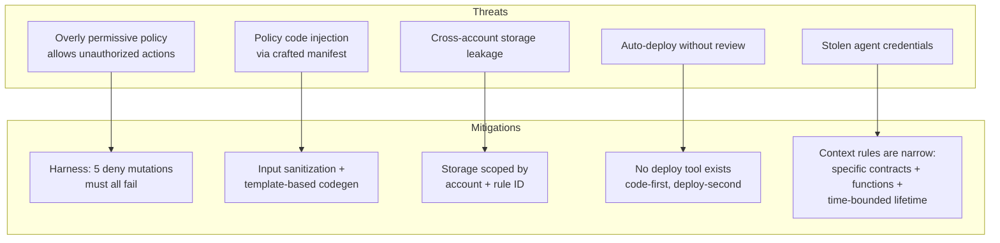

### Security Properties

| Property | Implementation |
|----------|---------------|
| Minimal permission | Synthesizer only permits observed contracts/functions |
| Spending caps | Derived from observed amounts (with optional headroom) |
| Time-bounded | Context rules have explicit `lifetime_seconds` |
| No auto-deploy | `emit_policy_crate` returns file strings, never deploys |
| Deny-case validation | Harness tests 5 mutations; all must be rejected |
| Storage isolation | All state scoped by `(smart_account, context_rule.id)` |
| Review gate | REVIEW.md checklist is always generated and shown |
| Audit trail | Transaction hash recorded in manifest for provenance |

### Authentication Flow (Remote Mode)

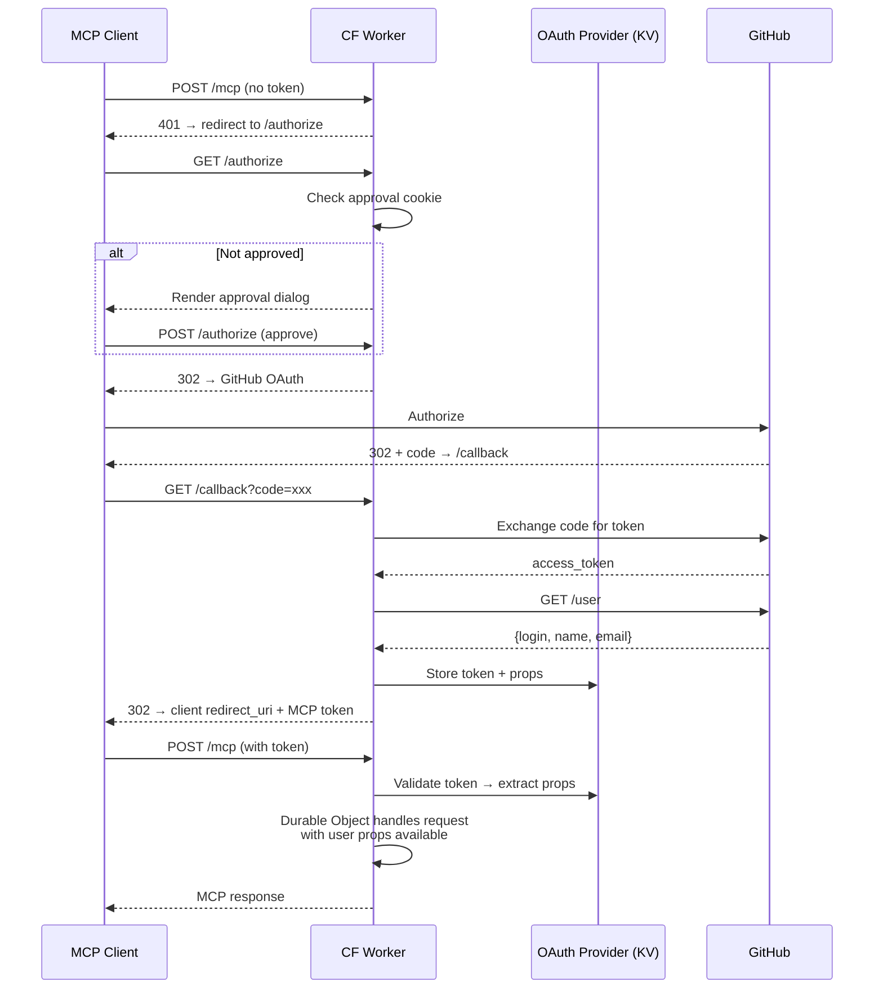

---

## Deployment Architecture

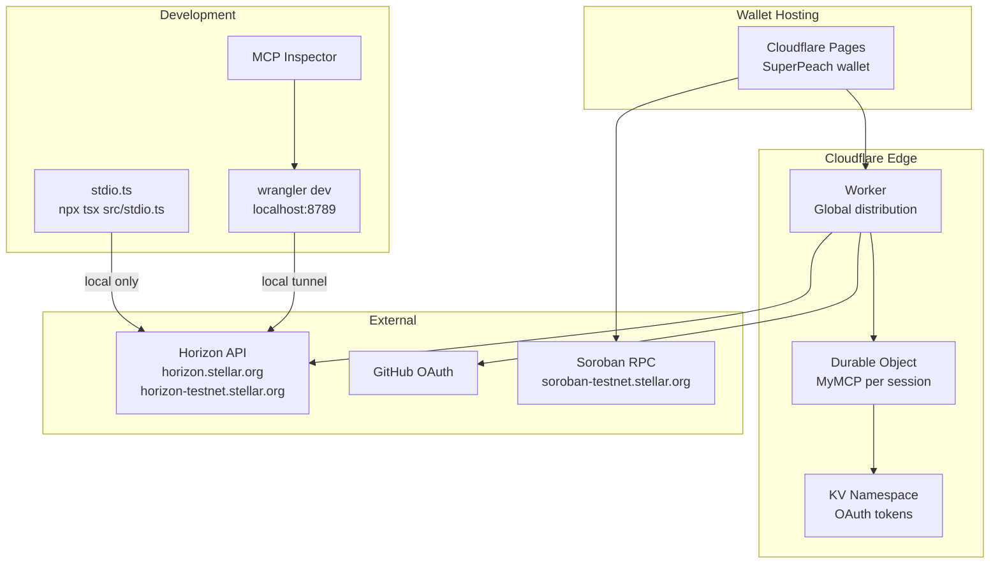

### Environment Configuration

| Environment | Entry Point | Auth | Horizon | Deploy Method |
|-------------|------------|------|---------|---------------|
| Local (Claude) | `src/stdio.ts` | None | testnet | `npx tsx` |
| Local (HTTP) | `wrangler dev` | GitHub OAuth (localhost) | testnet | wrangler |
| Production | `wrangler deploy` | GitHub OAuth (workers.dev) | mainnet + testnet | wrangler |

---

## Technology Stack

### TypeScript (MCP Server + Pipeline)

| Layer | Technology | Version | Purpose |
|-------|-----------|---------|---------|
| Runtime | Cloudflare Workers | Latest | Edge compute, global distribution |
| MCP SDK | `@modelcontextprotocol/sdk` | 1.13.1 | MCP protocol implementation |
| Agent Framework | `agents` (Cloudflare) | 0.0.100 | Durable Object MCP agent |
| HTTP Framework | Hono | 4.8.3 | OAuth route handling |
| Validation | Zod | 3.25.67 | Input schema validation |
| OAuth | `@cloudflare/workers-oauth-provider` | 0.0.5 | GitHub OAuth flow |
| GitHub API | Octokit | 5.0.3 | User identity verification |
| Testing | Vitest | 3.2.4 | Unit tests |
| Build | Wrangler | 4.23.0 | Worker bundling + deploy |
| Monorepo | Turborepo | 2.9.6 | Task orchestration |
| Package Manager | pnpm | 9.0.0 | Dependency management |

### Rust (Contract Layer)

| Crate | Version | Purpose |
|-------|---------|---------|
| soroban-sdk | 26.1.0 | Soroban smart contract SDK |
| stellar-xdr | 27.0.0 | XDR encoding/decoding |
| stellar-accounts | 0.7.2 | OZ Policy trait + smart account framework |
| serde / serde_json | 1.0 | Serialization (for core library) |
| proptest | 1.4 | Property-based testing |

### Wallet (SuperPeach)

| Technology | Purpose |
|-----------|---------|
| Astro | Static site generation + SSR |
| Svelte | Reactive UI components |
| Tailwind CSS | Styling |
| `@stellar/stellar-sdk` | Stellar transaction building |
| `passkey-kit` | WebAuthn-based smart account management |
| Cloudflare Pages | Hosting |

---

## Extension Points

### Adding a New Policy Primitive

1. Create `contracts/policies/my-primitive/` with `Cargo.toml` + `src/lib.rs`
2. Implement the `Policy` trait from `stellar-accounts`
3. Add to `contracts/policy-primitives/` if it's a reusable building block
4. Register in `apps/mcp-server/src/pipeline/primitives.ts` (`OZ_PRIMITIVES` array)
5. Add detection logic in `synthesizer.ts` decision tree
6. Add template rendering in `emitter.ts`

### Adding a New Protocol Adapter

1. Create `contracts/protocol-adapters/my-protocol/`
2. Implement protocol-specific address resolution, function detection, and constraint extraction
3. Add contract ID to `PROTOCOL_REGISTRY` in `manifest.ts`
4. Add adapter import path to `emitter.ts` `renderCargoToml()` / `renderGenerateLib()`

### Adding a New MCP Tool

1. Define Zod schema in `src/types.ts`
2. Implement handler in `src/tools/policy-tools.ts`
3. Register in `registerPolicyTools()` via `server.tool()`
4. Add equivalent in `src/stdio.ts` for local mode

### Adding a New Harness Mutation

1. Add mutation definition in `harness.ts` `mutations` array:
   ```ts
   { name: "my_mutation", description: "...", fn: (m) => { /* mutate manifest */ } }
   ```
2. The harness automatically runs all mutations and expects DENY for each

---

## Design Decisions & Rationale

| Decision | Rationale |
|----------|-----------|
| TypeScript pipeline mirrors Rust core | Cloudflare Workers cannot run WASM (Soroban) directly; TS port enables serverless execution without compilation |
| No auto-deploy | Security property: generated code must be reviewed. Deployment is always explicit. |
| Stateless tools | Enables horizontal scaling, deterministic testing, and idempotent retries |
| 5-layer cap | OZ smart accounts enforce max 5 policies per context rule |
| Clarification loop | Synthesizer asks rather than guesses when parameters are ambiguous |
| Dual transport (stdio + HTTP) | Covers both local Claude Desktop and multi-user remote deployment |
| Composition-first | Uses existing audited OZ primitives before generating new code |
| Harness runs before emit | Prevents shipping overly permissive policies |
| Template-based codegen | Avoids injection vectors; generated code follows known-good patterns |
| GitHub OAuth for remote | Leverages existing developer identity; maps to RBAC for write access |

---

## Audit Surface

Components requiring security audit:

1. **Synthesizer decision tree** — ensures minimal permissions are generated
2. **Emitter templates** — generated Rust must correctly implement Policy trait
3. **Harness evaluator** — deny cases must accurately model real policy enforcement
4. **Storage segregation** — all generated code must scope by `(account, rule_id)`
5. **Pre-built policy contracts** — spending-limit, time-window, etc.
6. **Policy-primitives crate** — base traits used by all generated/composed policies

Components NOT requiring audit (non-security-critical):

- MCP transport layer (uses well-tested SDK)
- OAuth flow (delegates to GitHub)
- Wallet UI (no policy logic)
- Documentation site
